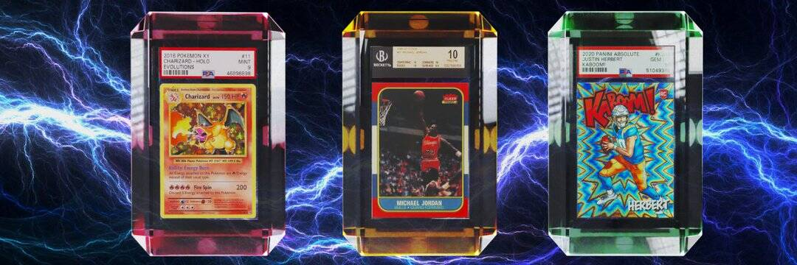

# OnlyGems Gem Pass

宝石通行证包含 7,200 个 NFT，是您从 OnlyGems 生态系统中解锁特权和奖励的钥匙。 更多信息可以在 OnlyGems.io 上找到。

OnlyGems Gem Pass NFT - 常见问题（FAQ）

▶ 什么是 OnlyGems 宝石通行证？

OnlyGems Gem Pass 是一个 NFT（非同质代币）集合。存储在区块链上的数字艺术品集合。

▶ 有多少 OnlyGems 宝石通行证代币？

总共有 4 个 OnlyGems Gem Pass NFT。目前，34 位所有者的钱包中至少有一个 OnlyGems Gem Pass NTF。

▶ 最昂贵的 OnlyGems 宝石通行证销售是什么？

最昂贵的 OnlyGems Gem Pass NFT 是 [Diamond Gem Pass](https://www.nft-stats.com/asset/0xdfb521eaa714e183cc3d9c9480c73ca7772c3e1e/3)。它于 2022 年 6 月 16 日（2 个月前）以 809.7 美元的价格售出。

▶ 最近卖出了多少只 OnlyGems 宝石通行证？

过去 30 天内售出了 1 个 OnlyGems Gem Pass NFT。

