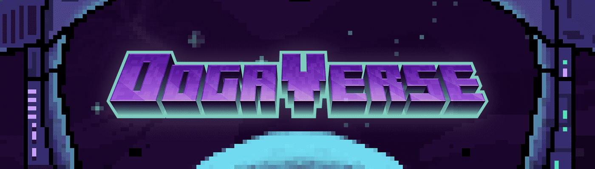

# OogaVerse

MekaApes 游戏现已推出！！每个婴儿 Ooga 和孵化器都可以领取一次 MekaApe！ 看看 Baby Ooga 是否已经在这里认领了 MekaApe！加入我们的 Discord 以了解更多信息。Old Collection: SpaceApes 在这篇 Medium 文章中查找有关迁移和名称更改的所有信息。OogaVerse 是一个包含 2,000 个 Genesis Oogas 和 6,000 个的 NFT 集合 宝贝奥加斯。 Baby Oogas 可以通过持有 2 个 Genesis Oogas 来繁殖！ （育种现已上线！）

OogaVerse NFT - 常见问题（FAQ）

▶ 什么是 OogaVerse？

OogaVerse 是一个 NFT（非同质代币）集合。存储在区块链上的数字艺术品集合。

▶ 存在多少 OogaVerse 代币？

总共有 6,754 个 OogaVerse NFT。目前，956 位所有者的钱包中至少有一个 OogaVerse NTF。

▶ 最昂贵的 OogaVerse 销售是什么？

售出的最昂贵的 OogaVerse NFT 是 [Ooga #1690](https://www.nft-stats.com/asset/0x9ebab3b21b5ef5709bd476b022fc432fc84c0e86/1391138)。它于 2022-06-04（3 个月前）以 727.8 美元的价格售出。

▶ 最近卖出了多少 OogaVerse？

过去 30 天内售出了 140 个 OogaVerse NFT。

▶ OogaVerse 需要多少钱？

在过去 30 天里，最便宜的 OogaVerse NFT 销售额低于 69 美元，最高销售额超过 658 美元。在过去 30 天内，OogaVerse NFT 的中位价格为 114 美元。

