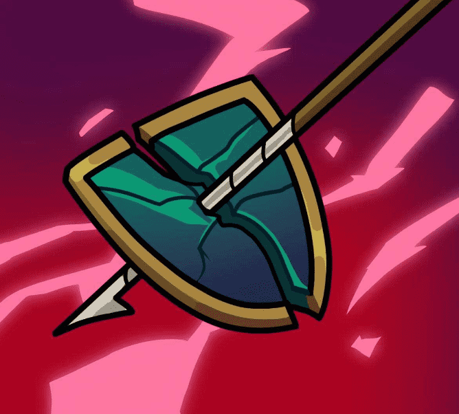

# OpenBlox NFT Badge

欢迎来到 OpenSOpenBlox NFT 徽章 NFT - 常见问题（FAQ）

▶ 什么是 OpenBlox NFT 徽章？

OpenBlox NFT 徽章是一个 NFT（不可替代令牌）集合。存储在区块链上的数字艺术品集合。

▶ 存在多少 OpenBlox NFT 徽章代币？

总共有 2,500 个 OpenBlox NFT 徽章 NFT。目前，2,381 位所有者的钱包中至少有一个 OpenBlox NFT 徽章 NTF。

▶ 最近卖出了多少 OpenBlox NFT 徽章？

在过去 30 天内售出了 0 个 OpenBlox NFT 徽章 NFT。

▶ 有哪些流行的 OpenBlox NFT 徽章替代品？

许多拥有 OpenBlox NFT 徽章 NFT 的用户还拥有 [Anmonkeys](https://www.nft-stats.com/collection/animonkeys)、 [TIMEPieces Slices of TIME（艺术家）](https://www.nft-stats.com/collection/timepieces-sot-artists)、 [TIMEPieces Build a Better Future: Genesis Drop](https://www.nft-stats.com/collection/timepieces-build-a-better-future-genesis-drop)和 [Animetas](https://www.nft-stats.com/collection/animetas)。

a 上的 OpenBlox NFT 徽章主页。 发现这个系列中最好的项目。

