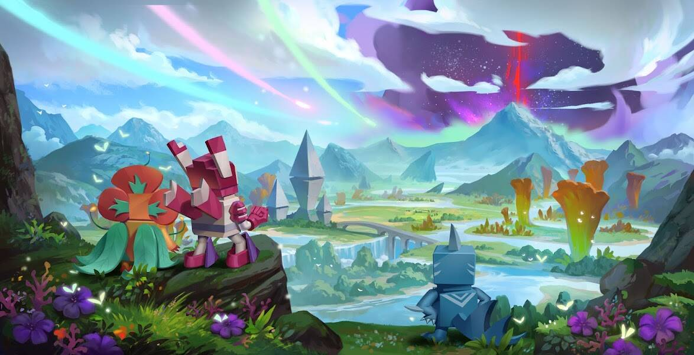

# OpenBlox V3

OpenBlox 是一个基于 EVM 的 NFT 游戏平台，专注于 Play and Earn 和 IP 品牌推广，它在 OpenBlox 世界的所有游戏中利用一组 Blox NFT 和代币。OpenBlox 的核心是基于 7,998 个创世 blox NFT，可以 基于基因机制的品种，并在所有 OpenBlox 游戏中使用。RunBlox，一款基于移动的健身游戏，集成了真实运动和 NFTRogueBlox，一款回合制 Rogue 类 PVE 卡牌游戏ActionBlox，一款 PVP 赢取 MMORPG 游戏LandBlox，一款 时尚的农场游戏和赚钱游戏OpenBlox Marketplace：https://marketplace.openblox.io/

