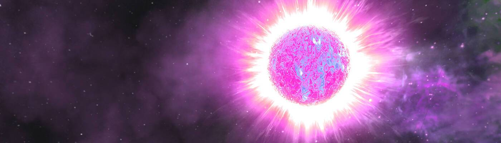

# openGalaxy Stars

每一个星系都是一个有思想、有感情和有朋友的生物。 恒星可以承载行星，并以其稀有性和在开放星系中的位置以及它们独特的物理特性和能力而著称。

openGalaxy Stars NFT - 常见问题（FAQ）

▶ 什么是openGalaxy Stars？

openGalaxy Stars 是一个 NFT（不可替代代币）集合。存储在区块链上的数字艺术品集合。

▶ 有多少 openGalaxy Stars 代币？

总共有 435 个 openGalaxy Stars NFT。目前，17 位所有者的钱包中至少有一个 openGalaxy Stars NTF。

▶ 最近卖出了多少个openGalaxy Stars？

过去 30 天内售出 0 个 openGalaxy Stars NFT。

