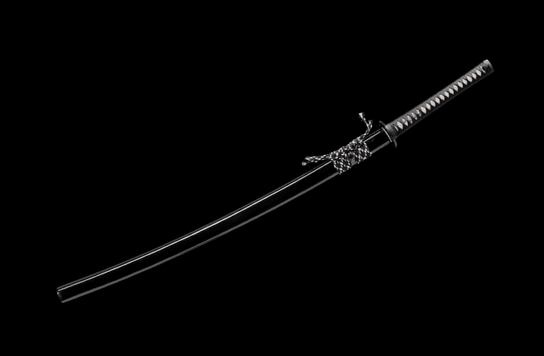

# OpenSamurai

Open Samurai 是随机生成并存储在链上的武士装备。 故意省略统计信息、图像和其他功能以供其他人解释。 随意以任何你想要的方式使用 Open Samurai。 这是 Loot Project 的一个分支。

关于如何铸币的说明。 如果在您尝试领取 Kaban 时汽油价格非常高。 这意味着它已经声称在 0-7777 之间尝试另一个。 此外，进行比赛并赠送最佳衍生品。http://OpenSamurai.io 已上线。 Open Samurai 是随机生成并存储在链上的武士装备。

  如果您满足以下条件，您可以获得免费的 NFT：

1. 转发这个
2.标记两个朋友
3. 加入我们的 Discord，今天就认领你的 NFT。

