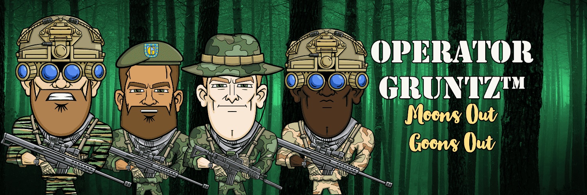

# OPERATOR GRUNTZ

OPERATOR GRUNTZ (OG) 系列是 GRUNTZ 社区精英成员的限量版系列，他们已经完成了他们之前的严格道路，以获得他们作为 OG 的精英地位。 该系列反映了军队的特种部队社区，代表了一小部分成功冒险穿越地狱并返回成为操作员的爱国者。GRUNTZ 是一个漫画风格的战斗士兵联盟，等待他们部署到 ETH 区块链上 分散的战斗力量。 每个 NFT 拥有超过 30 面国旗和 90 多个独特的手绘特征，代表并捍卫他的国家、遗产、价值观，最重要的是，他在 Metaverse 中的身份。GRUNTZ #JoinTheAlliance #UnitedWeStand #OG #OPERATORZ #LWDWLive Well。 死得好。

