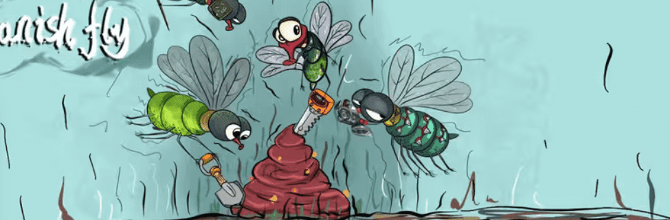

# Ops! Spanishfly!

行动！西班牙苍蝇！NFT - 常见问题（FAQ）

▶ 什么是行动！西班牙苍蝇！？

行动！西班牙苍蝇！是一个 NFT（不可替代代币）集合。存储在区块链上的数字艺术品集合。

▶ 多少操作！西班牙苍蝇！代币存在吗？

总共有 423 个操作！西班牙苍蝇！NFT。目前 166 位所有者至少拥有一个 Ops！西班牙苍蝇！NTF 在他们的钱包里。

▶ 什么是最昂贵的 Ops！西班牙苍蝇！销售？

最昂贵的操作！西班牙苍蝇！出售的 NFT 是 [Spanishfly NFT#9](https://www.nft-stats.com/asset/0x15776ab9e410c8d6ea4d1d216ea808e5549351d7/9)。它于 2022-06-24（2 个月前）以 16.5 美元的价格售出。

▶ 多少操作！西班牙苍蝇！最近有卖吗？

有 18 次行动！西班牙苍蝇！过去 30 天内售出的 NFT。

▶ Ops 多少钱！西班牙苍蝇！成本？

在过去 30 天内，最便宜的 Ops！西班牙苍蝇！NFT 销售额低于 8 美元，最高销售额超过 16 美元。Ops 的中位数价格！西班牙苍蝇！NFT 在过去 30 天内为 13 美元。

▶ 什么是流行的 Ops！西班牙苍蝇！备择方案？

许多拥有 Ops 的用户！西班牙苍蝇！NFT 还拥有 [MyFuckingEgg](https://www.nft-stats.com/collection/myfuckingegg)、 [Dick Ape Yacht Club](https://www.nft-stats.com/collection/dickapeyachtclub)、 [Bored Ape Beach Hut](https://www.nft-stats.com/collection/bored-ape-beach-hut)和 [Chronix Genesis](https://www.nft-stats.com/collection/chronix-genesis)。

