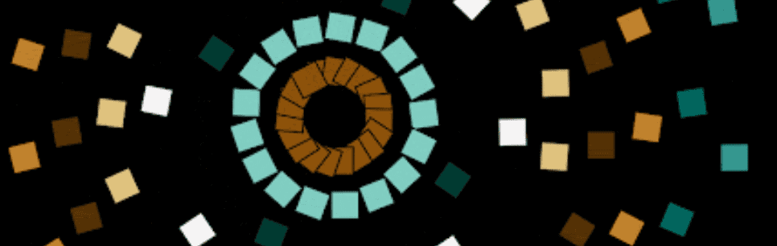

# orbits generative art

2019 年，我深受 Alexai Shulgin 的“形式艺术”的影响，我使用 p5.js 制作的第一批生成视觉作品之一是在浏览器上制作环绕的 html 单选按钮。 可以在我的网站“https://berkozdemir.com/”和 SuperRare（作为 radiOrbit#1 和 #2）上查看实时草图。 “ørß1t$”是更新版本，为链上生成艺术目的而重写；它显示了每个铸币厂的不同对象形状、调色板和分布、轨道方向和速度的独特组合。您可以单击画布并在 x 中移动 -axis 更改整体旋转速度。

轨道生成艺术 NFT - 常见问题（FAQ）

▶ 什么是轨道生成艺术？

轨道生成艺术是一个 NFT（不可替代令牌）集合。存储在区块链上的数字艺术品集合。

▶ 存在多少个轨道生成艺术代币？

总共有 333 个轨道生成艺术 NFT。目前 237 位所有者的钱包中至少有一个轨道生成艺术 NTF。

▶ 最昂贵的轨道生成艺术销售是什么？

售出的最昂贵的轨道生成艺术 NFT 是 [ørß1t$ - #252](https://www.nft-stats.com/asset/0x290841ba121462f90ea527849bd5302c50b6afb5/252)。它于 2022 年 6 月 20 日（2 个月前）以 11 美元的价格出售。

▶ 最近售出了多少轨道生成艺术？

过去 30 天内售出了 1 个轨道生成艺术 NFT。

