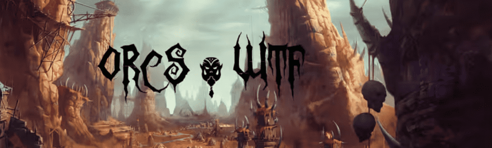

# orcs.wtf

orcs.wtf NFT - 常见问题（FAQ）

▶ 什么是 orcs.wtf？

orcs.wtf 是一个 NFT (Non-fungible token) 集合。存储在区块链上的数字艺术品集合。

▶ 存在多少个 orcs.wtf 代币？

总共有 3,327 个 orcs.wtf NFT。目前 195 位所有者的钱包中至少有一个 orcs.wtf NTF。

▶ 最昂贵的 orcs.wtf 销售是什么？

售出的最昂贵的 orcs.wtf NFT 是 [orcswtf #695](https://www.nft-stats.com/asset/0xb9d7b835b611bade76ad255df731c9cbce8a5e64/695)。它于 2022-06-18（2 个月前）以 8.8 美元的价格售出。

▶ 最近卖了多少orcs.wtf？

过去 30 天内售出了 22 个 orcs.wtf NFT。

▶ orcs.wtf 需要多少钱？

在过去 30 天里，最便宜的 orcs.wtf NFT 销售额低于 1 美元，最高销售额超过 9 美元。过去 30 天内，一个 orcs.wtf NFT 的中位价格为 2 美元。

▶ 什么是流行的 orcs.wtf 替代品？

许多拥有 orcs.wtf NFT 的用户还拥有 [shadowznft.xyz](https://www.nft-stats.com/collection/shadowznft)、 [The Project Cats Official](https://www.nft-stats.com/collection/the-project-cats-official)、 [BODA PASS](https://www.nft-stats.com/collection/boda-pass)和 [Aidea](https://www.nft-stats.com/collection/aideanft)。

[![img](https://www.nft-stats.com/goof1.gif

