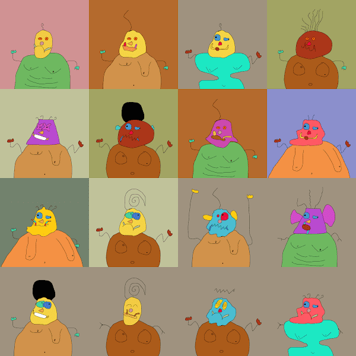

# Orctown.wtf V2

Orctown.wtf V2 NFT - 常见问题（FAQ）

▶ 什么是 Orctown.wtf V2？

Orctown.wtf V2 是一个 NFT (Non-fungible token) 集合。存储在区块链上的数字艺术品集合。

▶ 存在多少 Orctown.wtf V2 代币？

总共有 6,666 个 Orctown.wtf V2 NFT。目前 586 位所有者的钱包中至少有一个 Orctown.wtf V2 NTF。

▶ 最近售出了多少 Orctown.wtf V2？

过去 30 天内售出 0 个 Orctown.wtf V2 NFT。

▶ 最昂贵的 Orktown-wtf 销售是什么？

售出的最昂贵的 Orktown-wtf NFT 是 [Orktown #6466](https://www.nft-stats.com/asset/0xb2263b609a64bbf5f0666ad46ef5901d88d8e952/6466)。它于 2022-06-06（3 个月前）以 18.8 美元的价格售出。

▶ 什么是流行的 Orktown-wtf 替代品？

许多拥有 Orktown-wtf NFT 的用户还拥有 [aigoblintown.wtf](https://www.nft-stats.com/collection/aigoblintown-wtf)、 [HumansTown.WTF](https://www.nft-stats.com/collection/humanstown)、 [OC Marilyn Diptychs](https://www.nft-stats.com/collection/oc-marilyn-diptychs)和 [Alright Apes](https://www.nft-stats.com/collection/alright-apes)。

