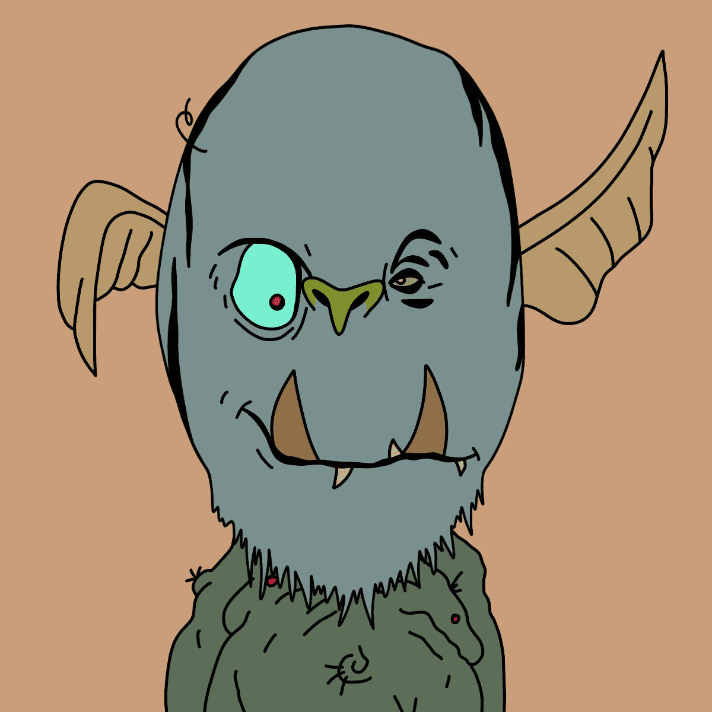

# orctown.wtf.

Stooopid GAWBLINz 是令人讨厌的老鼠，这不好。 丑陋的斑点小老鼠，我不代表他们。没有路线图。 没有不和谐。 没有实用性。 CC0。

兽人镇.wtf。NFT - 常见问题（FAQ）

▶ 什么是 orctown.wtf.？

兽人镇.wtf。是一个 NFT（不可替代代币）集合。存储在区块链上的数字艺术品集合。

▶ 多少 orctown.wtf。代币存在吗？

总共有 6,966 orctown.wtf。NFT。目前，664 位所有者至少拥有一个 orctown.wtf。NTF 在他们的钱包里。

▶ 多少 orctown.wtf。最近有卖吗？

有 0 个 orctown.wtf。过去 30 天内售出的 NFT。

▶ 什么是流行的 orctown.wtf。备择方案？

许多拥有 orctown.wtf 的用户。NFT 还拥有 [Okay Duck Pixel Club](https://www.nft-stats.com/collection/okay-duck-pixel-club)、 [Omni Node Toads (ETH)](https://www.nft-stats.com/collection/omni-node-toads)、 [EL NUMEROS](https://www.nft-stats.com/collection/elnumeros)和 [DegenOkayBears](https://www.nft-stats.com/collection/degenbears)。

