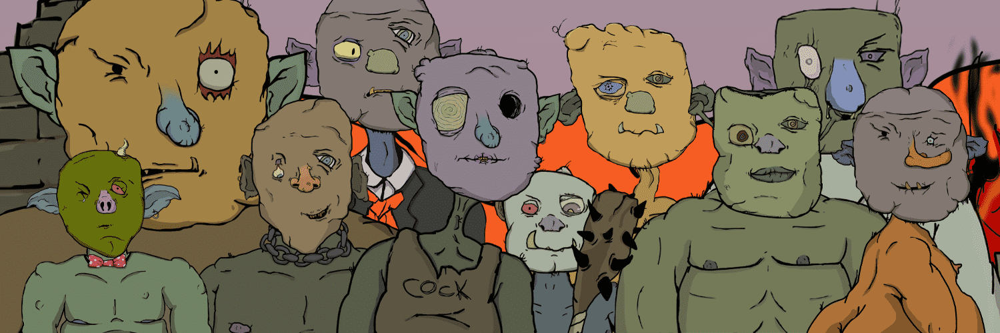

# orcvillage.wtf

ORc HaeV Big BODDDY GEhblin smoL.. 它是让 ORC 粉碎 Sum GoBLINNNS 并在 EtRUM BLOCKSHIN 上传播 Sum SHIett NEFTEE O ORC 的时间？ 哇！ SOOOOO MENY DJen 在这里滚出去！ 赞美皇后 EmbAR EUUUUURGHHHH

orcvillage.wtf NFT - 常见问题（FAQ）

▶ 什么是 orcvilage.wtf？

orcvillage.wtf 是一个 NFT（非同质代币）集合。存储在区块链上的数字艺术品集合。

▶ 有多少 orcvilage.wtf 代币？

总共有 5,000 个 orcvilage.wtf NFT。目前，1,092 位所有者的钱包中至少有一个 orcvilage.wtf NTF。

▶ 最昂贵的 orcvilage.wtf 销售是什么？

售出的最昂贵的 orcvilage.wtf NFT 是 [orcvilage.wtf #3598](https://www.nft-stats.com/asset/0xd1c352788be45e2896a24780a53e83dae4543ff0/3598)。它于 2022 年 6 月 11 日（2 个月前）以 3.7 美元的价格售出。

▶ 最近卖了多少 orcvilage.wtf？

过去 30 天内售出了 17 个 orcvilage.wtf NFT。

▶ orcvilage.wtf 需要多少钱？

在过去 30 天里，orcvillage.wtf NFT 最便宜的销售额低于 2 美元，最高销售额超过 7 美元。在过去 30 天内，orcvilage.wtf NFT 的中位价格为 4 美元。

▶ 什么是流行的 orcvilage.wtf 替代品？

许多拥有 orcvillage.wtf NFT 的用户还拥有 [A Familiar Memory: Chapter Two](https://www.nft-stats.com/collection/a-familiar-memory-chapter-two) , [DigBicks Adventure](https://www.nft-stats.com/collection/digbicksadventure) , [Not Goblins](https://www.nft-stats.com/collection/not-goblins) and [Baba Universe](https://www.nft-stats.com/collection/babauniverse)。

