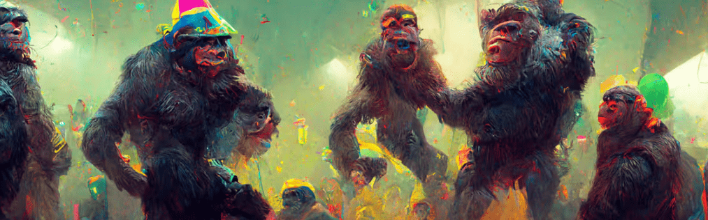

# Original Real Baby Apes

Lil Baby Ape Club NFT 在过去 7 天内售出 12 次。Lil Baby Ape Club 的总销售额为 735.8 美元。一个 Lil Baby Ape Club NFT 的平均价格为 61.3 美元。有 2,277 名 Lil Baby Ape Club 所有者，拥有总供应量 5,000 个代币。

Lil Baby Ape Club NFT - 常见问题（FAQ）

▶ 什么是 Lil Baby Ape 俱乐部？

Lil Baby Ape Club 是一个 NFT（非同质代币）集合。存储在区块链上的数字艺术品集合。

▶ 有多少 Lil Baby Ape Club 代币？

总共有 5,000 个 Lil Baby Ape Club NFT。目前，2,277 位车主的钱包中至少有一个 Lil Baby Ape Club NTF。

▶ Lil Baby Ape Club 最贵的促销是什么？

售出的最昂贵的 Lil Baby Ape Club NFT 是 [#1555](https://www.nft-stats.com/asset/0x918f677b3ab4b9290ca96a95430fd228b2d84817/1555)。它于 2022-07-27（29 天前）以 422.1 美元的价格售出。

▶ 最近卖了多少 Lil Baby Ape Club？

过去 30 天内售出了 47 个 Lil Baby Ape Club NFT。

▶ Lil Baby Ape Club 的费用是多少？

在过去 30 天里，最便宜的 Lil Baby Ape Club NFT 销售额低于 22 美元，最高销售额超过 117 美元。过去 30 天，Lil Baby Ape Club NFT 的中位价格为 56 美元。

▶ 什么是流行的 Lil Baby Ape Club 替代品？

许多拥有 Lil Baby Ape Club NFT 的用户还拥有 [Winter Baby Ape Club](https://www.nft-stats.com/collection/winter-baby-ape-club)、 [BladeRunnerPunks](https://www.nft-stats.com/collection/bladerunner-punks)、 [Teen Rebel Ape Club](https://www.nft-stats.com/collection/teenrebelapeclub)和 [Grandpa Ape Country Club](https://www.nft-stats.com/collection/grandpaapecountryclub)。

