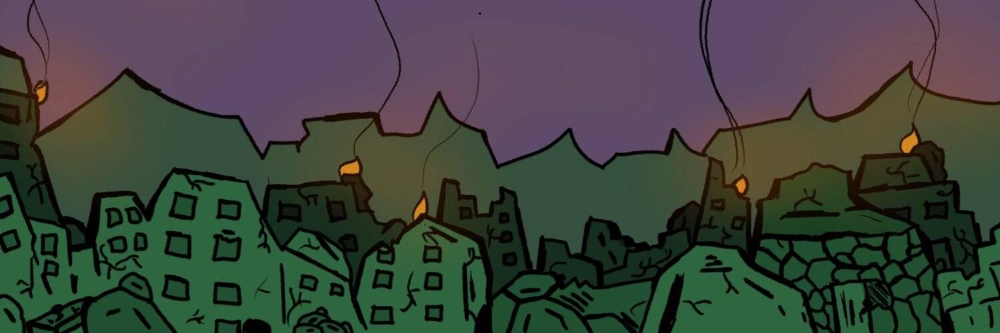

# orktownwtf

orktownwtf 是令人讨厌的老鼠，这不好。丑陋的斑点小老鼠，我不代表他们。

没有路线图。没有不和谐。没有实用性。CC0。

orktownwtf NFT - 常见问题（FAQ）

▶ 什么是 orktownwtf？

orktownwtf 是一个 NFT（非同质代币）集合。存储在区块链上的数字艺术品集合。

▶ 有多少 orktownwtf 代币？

总共有 5,892 个 orktownwtf NFT。目前，2,068 位所有者的钱包中至少有一个 orktownwtf NTF。

▶ 最近卖了多少 orktownwtf？

过去 30 天内售出 0 个 orktownwtf NFT。

▶ 什么是流行的 orktownwtf 替代品？

许多拥有 orktownwtf NFT 的用户也拥有 [外福药水](https://www.nft-stats.com/collection/waifu-potions)， [想帮忙但我很烂](https://www.nft-stats.com/collection/wanna-help-but-i-suck)， 锦鲤池[| ](https://www.nft-stats.com/collection/koi-pond-v2-1)[一护玉桥](https://www.nft-stats.com/collection/koi-pond-v2-1)和 [涂鸦神](https://www.nft-stats.com/collection/doodle-gods)。

