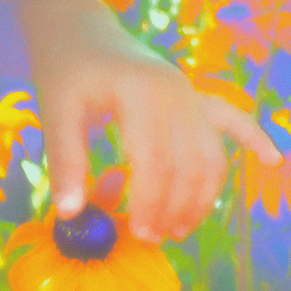

# oshi's music

oshi 的音乐 NFT 在过去 7 天内售出 1 次。oshi 的音乐总销售额为 337.04 美元。一个 oshi 的音乐 NFT 的平均价格是 337 美元。有 67 名 oshi 的音乐所有者，总共拥有 105 个代币。

大家好，这是我的音乐<3

oshi 的音乐 NFT - 常见问题（FAQ）

▶ 什么是 oshi 的音乐？

oshi 的音乐是一个 NFT（不可替代令牌）集合。存储在区块链上的数字艺术品集合。

▶ oshi 的音乐代币有多少？

oshi 的音乐 NFT 总共有 105 个。目前，67 位所有者的钱包中至少有一个 oshi 的音乐 NTF。

▶ oshi 最昂贵的音乐销售是什么？

最昂贵的 oshi 音乐 NFT 是 [black eyes (with Mara Anne) #24](https://www.nft-stats.com/asset/0x3bf96afe2291d76f2934350624080faefeec9a46/1020847100762815390390123822295304634392)。它于 2022-06-28（大约 2 个月前）以 337 美元的价格售出。

▶ 最近卖了多少oshi的音乐？

过去 30 天内卖出了 1 个 oshi's music NFT。

▶ oshi 的流行音乐替代品是什么？

许多拥有 oshi 音乐 NFT 的用户还拥有 [Grady](https://www.nft-stats.com/collection/grady-1)、 [Iman Europe](https://www.nft-stats.com/collection/iman-europe)、 [Soulection+ Radio: UNTITLED 001](https://www.nft-stats.com/collection/soulection)和 [slenderbodies](https://www.nft-stats.com/collection/slenderbodies)。

