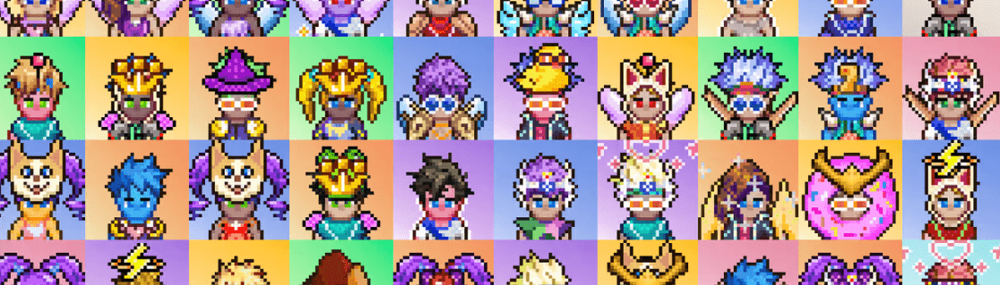

# Osiris Cosmic Kids

Cosmic Kids 是自由、快乐、精神的集合体，是元界奥西里斯 (Osiris) 的可玩化身。 Osiris 是一个动态的 2D 虚拟世界。 要访问 Osiris，首先要获取 Cosmic Kid，这是以太坊上独特的 ERC-721 实用程序令牌。 不和谐 - 网站

Osiris Cosmic Kids NFT - 常见问题（FAQ）

▶ 什么是 Osiris Cosmic Kids？

Osiris Cosmic Kids 是一个 NFT（不可替代代币）系列。存储在区块链上的数字艺术品集合。

▶ 存在多少 Osiris Cosmic Kids 代币？

总共有 9,999 个 Osiris Cosmic Kids NFT。目前，2,516 位车主的钱包中至少有一个 Osiris Cosmic Kids NTF。

▶ 最昂贵的 Osiris Cosmic Kids 特卖是什么？

最昂贵的 Osiris Cosmic Kids NFT 是 [Cosmic Kid #467](https://www.nft-stats.com/asset/0x4ab6d8ff68330d844a3056ea2f8179a7e19759ff/467)。它于 2022 年 7 月 29 日（26 天前）以 211 美元的价格售出。

▶ 最近卖出了多少 Osiris Cosmic Kids？

过去 30 天内售出了 100 个 Osiris Cosmic Kids NFT。

▶ Osiris Cosmic Kids 的价格是多少？

在过去 30 天里，最便宜的 Osiris Cosmic Kids NFT 销售额低于 37 美元，最高销售额超过 70 美元。过去 30 天，Osiris Cosmic Kids NFT 的中位价格为 50 美元。

▶ 什么是流行的 Osiris Cosmic Kids 替代品？

许多拥有 Osiris Cosmic Kids NFT 的用户还拥有 [AnimeTracks](https://www.nft-stats.com/collection/avatracksanimetas)、 [MonsterBuds Green Room](https://www.nft-stats.com/collection/monsterbuds-green-room)、 [Packwoods](https://www.nft-stats.com/collection/packwoods)和 [Trippy GAN Toadz](https://www.nft-stats.com/collection/trippy-gan-toadz)。

