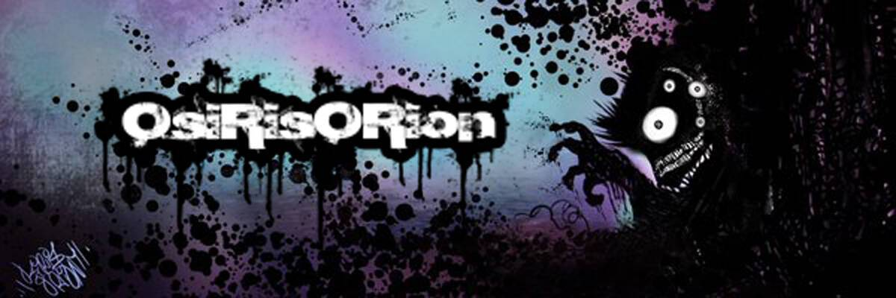

# OsiRisORion

OsirisORion 的大部分艺术生涯都在探索模拟艺术世界中的各种场景，但最出名的是他在低俗艺术和设计师乙烯基玩具领域的工作。 目前，OsiRisOrion 正在通过加密艺术场景的广阔数字空间进行冒险......在整个区块链中传播他的本能超现实主义品牌和扭曲的流行艺术愿景。OsiRisORion 的作品已自豪地在美国各地的画廊展出，并有幸获得 与艺术家/公司/组织合作，例如 Skinner、Motorbot、Tenacious Toys、GUUMON、Dead Hand Toys、Rumble Monsters、Dead Bear Studios、October Toys、Argonaut Resins、海报事业项目等等！

