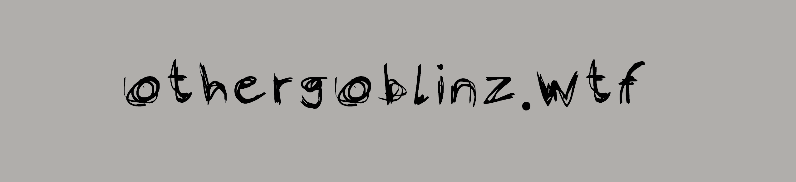

# othergoblinz.wtf

othergoblinz.wtf NFT - 常见问题（FAQ）

▶ 什么是其他地精.wtf？

othergoblinz.wtf 是一个 NFT (Non-fungible token) 集合。存储在区块链上的数字艺术品集合。

▶ 还有多少其他goblinz.wtf 代币？

总共有 1,770 个 othergoblinz.wtf NFT。目前，621 位所有者的钱包中至少有一个 othergoblinz.wtf NTF。

▶ 最近卖了多少 othergoblinz.wtf？

过去 30 天内售出 0 个 othergoblinz.wtf NFT。

▶ 什么是最贵的 othergoblintown.wtf。销售？

最贵的othergoblintown.wtf。出售的 NFT 是 [othergoblintown.wtf #77](https://www.nft-stats.com/asset/0xbd0da1d7a84ac5a670623404265ccea97674bf9d/77)。它于 2022-06-07（3 个月前）以 16.3 美元的价格售出。

▶ 多少其他地精城.wtf。最近有卖吗？

还有 1 个其他地精城.wtf。过去 30 天内售出的 NFT。

▶ 什么是流行的 othergoblinz.wtf 替代品？

许多拥有 othergoblinz.wtf NFT 的用户也拥有 [DOGE 滴](https://www.nft-stats.com/collection/minty-doge-drops)， Artifical [Mind | ](https://www.nft-stats.com/collection/artifical-mind)[AI](https://www.nft-stats.com/collection/artifical-mind)， [我们都将崛起](https://www.nft-stats.com/collection/we-are-all-going-to-rise)和 [goblintown.wtf OFFlClAL](https://www.nft-stats.com/collection/goblintownwtfofficial)。

