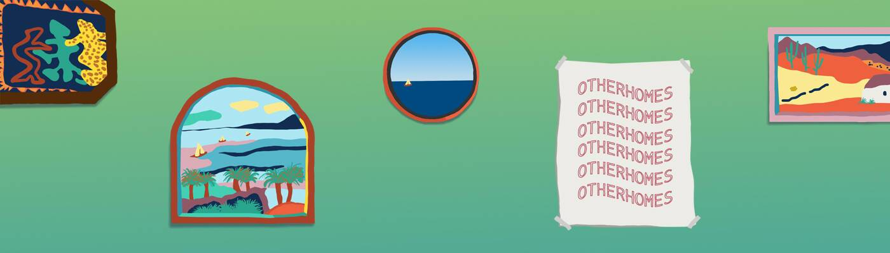

# otherhomes

欢迎回家。 otherhomes 是 1,111 个随机生成的生活空间的集合。 拥有一个 HOME 不仅意味着在 web3 领域拥有一个安全的空间，而且还有助于为无家可归的人提供一个安全的空间 IRL。 所有主要销售的 50% 用于安置无住房者。 我们希望邀请人们进入我们的家，联系并让所有人都感到宾至如归，就像我们在现实世界中所做的那样。其他家由精心策划的特征组成，为他们的主人提供高度个性化的艺术品，感觉轻盈而诱人。 一个有风景的房间，一个放帽子的地方，一条将 web3 之美扩展到物理世界的路径。

