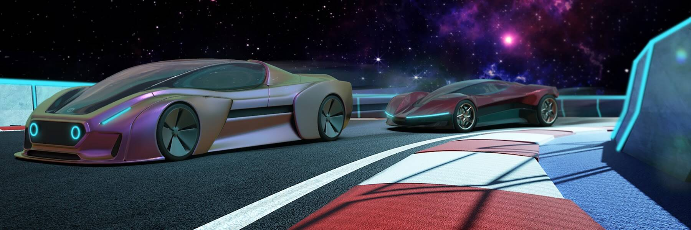

# OTOmotors

OTO Motors 是为收藏家和游戏玩家创建的 NFT OTOmobiles 平台。 每个 OTOmobile 都是在以太坊网络上以数字方式注册的 ERC-721 标准 NFT。 OTOmobiles 的所有者可以不断升级其资产的性能、注册功能和整体价值。

OTOmotors NFT - 常见问题 (FAQ)

▶ 什么是耳电机？

OTOmotors 是一个 NFT（不可替代代币）集合。存储在区块链上的数字艺术品集合。

▶ 有多少 OTOmotors 代币？

总共有 1,259 个 OTOmotors NFT。目前，309 位车主的钱包中至少有一个 OTOmotors NTF。

▶ 最昂贵的 OTOmotors 销售是什么？

最昂贵的 OTOmotors NFT 是 [SIRIUS](https://www.nft-stats.com/asset/0x2fbc53e14ea8e4c23be832a0389817e77744fdc1/116)。它于 2022-08-02（22 天前）以 70.3 美元的价格售出。

▶ 最近卖出了多少 OTOmotors？

过去 30 天内售出了 2 个 OTOmotors NFT。

