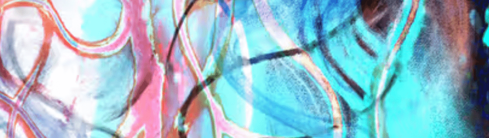

# Our Traces, Remaining Scent

我作品的主题是生命的光辉和生活的美。
我相信，人生最美好的态度，就是全力以赴面对这个世界，即使知道这一切终究会结束。
吃、爱、保护和死。

我想与尽可能多的人分享试图从泥泞中站起来的生活之美。

我们一生中所犯的所有错误、权利和伤害都塑造了我们现在的身份、习惯和行为。事实上，这是一种身份和人格的转变。过去的痕迹在不知不觉中留在我们的灵魂中，形成我们对今天的生活的看法，引导我们度过人生

