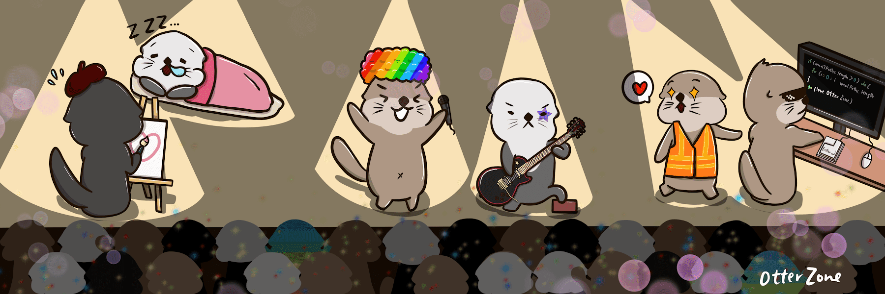

# OtterZone

Otter Zone 将进入 The Sandbox，为每个人提供一个娱乐和展示自己的平台。 长期回馈我们的社区。

 Otter Zone 將邁進元宇宙 The Sandbox建立海瀨城，打造一個娛樂平台，並致力長遠回饋社群

海瀨手牽手漂浮於海上，透過進食海膽保護海藻生長環境，令海藻能吸收更多二氧化碳，默默耕耘幫助我們抑制全球暖化。我們希望更多人能夠認識海瀨，並提高大家保育意識。

\- 孕育666隻海瀨NFT

OtterZone NFT - 常见问题（FAQ）

▶ 什么是 OtterZone？

OtterZone 是一个 NFT（不可替代令牌）集合。存储在区块链上的数字艺术品集合。

▶ 存在多少 OtterZone 代币？

总共有 129 个 OtterZone NFT。目前，72 位所有者的钱包中至少有一个 OtterZone NTF。

▶ 最近卖出了多少 OtterZone？

过去 30 天内售出 0 个 OtterZone 

NFT。

