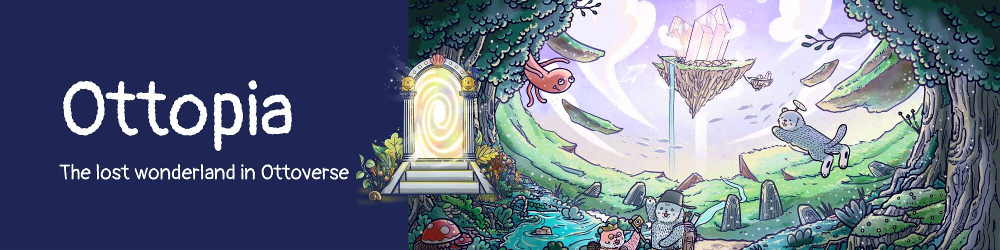

# Ottopia

奥托是水獭王国的第一位正式公民。 每个 Otto 都是具有独特特征和属性的 ERC721 NFT。 这些 NFT 不仅可爱到无法抗拒，而且恰好是 OtterClam 首款冒险游戏 Ottopia 的主角。通过结合 DeFi 和 NFT 元素，我们创造了一款独特的团体冒险游戏，为您的 Genesis Collection Otto NFT 提供 更实用。 拥有 Genesis Collection 中的 Otto NFT，您就有资格玩 Ottopia。 您的 Otto、Cleo 或 Lottie 也将充当您的个人治理令牌，允许您对在 Otter DAO 中提交的任何与 Otto 相关的提案进行投票。

Ottopia NFT 在过去 7 天内售出 2 次。Ottopia 的总销售额为 43.91 美元。一个 Ottopia NFT 的平均价格为 22 美元。有 404 位 Ottopia 所有者，总共拥有 1,847 个代币。

