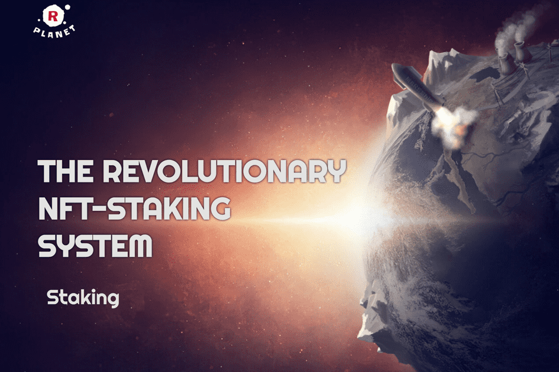

# R-PLANET

质押您未使用的 NFT 以获得利润和享受！
“R-PLANET”是一个革命性的 NFT 质押系统，它可以让你从未使用的 NFT 中受益并获得很多乐趣。
您可能有一些未使用的 NFT。不要让他们收集灰尘。
很快，您将能够从 R-PLANET NFT-DeFi 质押系统上列出的任何项目中质押 NFT。
最初，来自 Tribal Books 和 GPK 卡的 NFT 将可用于质押。
质押 NFT——我的以太币

基地是地图上玩家可以建造基础设施、军事和采矿业的地方。通过扩大基地，玩家可以增加为其服务的机器人数量。机器人不断消耗Wecanite，因此基础越大，他们在基础级别上消耗的Wecanite就越多。

此外，在基地开发过程中，玩家会逐渐教授自己的人工智能（AI）。随着时间的推移，当人工智能足够发达时，玩家可以建立一个新的基地或占领别人的基地。

