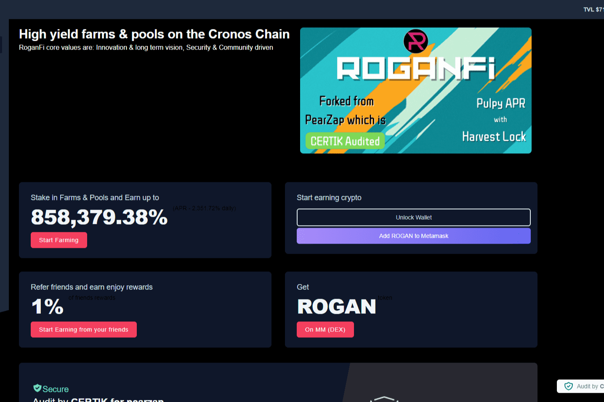

# RoganFi

Cronos Chain RoganFi 核心价值观上的高产农场和矿池是：创新和长期愿景，安全和社区驱动

Cronos 链上的高产农场和矿池

Cronos 是與 Crypto.org Chain 並行的 EVM 鏈。其主要目的是讓開發者可以快速從 Ethereum 和 EVM 相容區塊鏈移植應用程式，藉以大規模擴大 DeFi 生態系，並可連結 Crypto.com 生態系統內 1000 萬以上用戶群。

RoganFi 的核心价值观是：创新和长期愿景、安全和社区驱动

