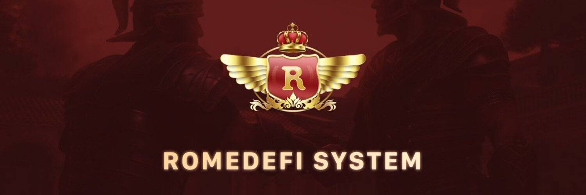

# RomeDefi

在法国大革命期间的《人权和公民权利宣言》中，自由被定义为“自由是做任何对他人无害的事情的权利”。罗马去中心化金融系统（ROMEDEFI SYSTEM）作为完全去中心化的全球自治系统，贯彻了区块链完全去中心化的精神。圣殿骑士团的选举和治理是通过罗马去中心化自治组织 RomeDAO 实施的。通过储备系统“RomeReserve”，罗马去中心化金融系统中所有协议产生的所有收益将分配给所有ROM持有者，实现完全的去中心化分配。罗马去中心化金融系统中的所有金融协议都将围绕 ROM 进行授权。 ROM将整合治理权、投票权和奖励权，成为罗马去中心化金融体系的唯一价值来源。
RomeDefi System 将竞选 EOS BP，并基于 EOSIO 重建罗马去中心化帝国。系统以重振罗马帝国昔日辉煌为愿景，致力于推动EOSIO技术的大规模应用，繁荣EOS主网生态。

