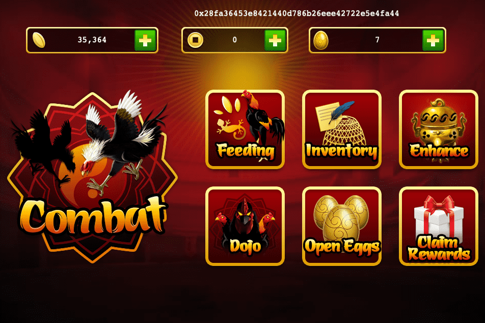

# Rooster Battle

公鸡大战是一款以世界上许多国家流行的斗鸡运动为蓝本的游戏，有着长达6000年的历史。 《雄鸡大战》游戏项目于2013年启动，迅速受到全球斗鸡爱好者的广泛关注，成为越南下载量第一的iOS应用。今年，我们很自豪地将这款游戏重制为一款去中心化的 PvP 游戏——BSC 上的 NFT 游戏。
斗鸡在6000年前就出现在地球上，已成为世界上最受欢迎的运动之一。话虽如此，还没有开发过关于斗鸡的视频游戏。 “公鸡大战”项目于2013年启动，迅速获得了全世界斗鸡爱好者的广泛关注。今年，我们很自豪地将这款游戏重制成一个分散的PVP游戏。

