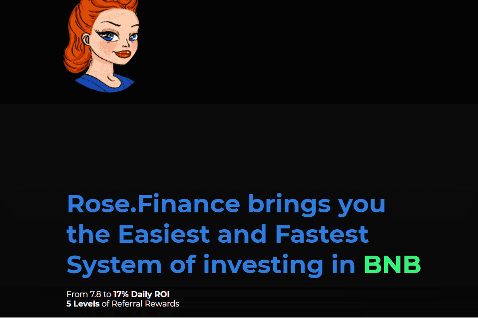

# Rose Finance

Rose.Finance为您带来最简单最快捷的BNB投资系统
从 7.8% 到 17% 的每日投资回报率 5 级推荐奖励

什么是罗森斯？
Rosefinance 是一个社交网络平台，可帮助建立一个购买和出售点赞/订阅的网络；一个全球平台，提供和提供获得参与和保留的专有技术。作为一种货币，它得到了一群具有出色技术和商业技能的人的支持，这些人除了为真正的用户创造真正的价值外，还会分享建议并向年轻团队展示正确的方向。与其他项目不同，Rosefinance 币将被视为社交网络交易的通用支付方式，但除了作为普及和影响者的平台外，它还为任何人提供了利用增加参与度的好处的机会。借助 Rosefinance 专有的增长引擎，您将获得追随者并喜欢以最佳速度提高参与度和保留率。

使命：
该网络平台围绕 Rosefinance 币（ROF）构建，这是一种基于币安智能链的加密货币代币，旨在激励真实用户/追随者和策展人共同发展社区内的财富以及品牌在公众和投资者中的印象。 Rosefinance 充当用户生成平台，允许品牌进行社交互动以建立其形象并吸引投资者。此外，它还允许 Rosenance 生态系统内的用户/追随者参与付费广告和内容营销计划，以及协助产品发布和选择加入直播。它采用了传统社交网络中的知名元素（帖子、点赞、评论、分享）

想象
Rosefinance 的目标是改变当今媒体和当前营销的运作方式，使全球电子商务民主化进入 5.0 时代。通过消除现在阻碍全球参与的所有边界和障碍，每个人都可以通过创造性地使用技术来实现货币化。借助 Rosefinance 生态系统，每个人都可以成为旅程的一部分，成为他们喜爱的品牌的代言人。

