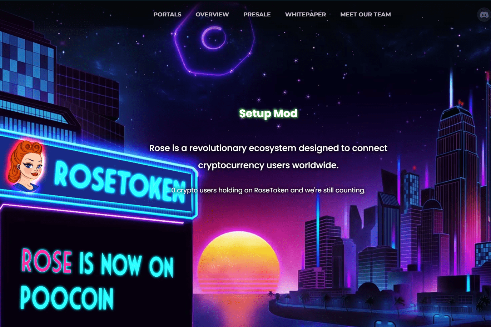

# RoseToken

Rose 代币是一种去中心化和通缩的 BEP-20 代币，最大供应量为 10 亿。 Rose Token 旨在提供维持和增长投资资本所需的稳定质押奖励，作为安全的资金存储，Rose Token 还旨在通过将我们的代币持有者聚集在一起来利用加密货币 (SocialFi) 的社会动态来操纵我们自己的市场益处。通过将我们的社会市场活动所获得的收益重新投资于 Rose 代币并像我们一样燃烧供应，我们在 Rose 代币上的财富存储可以可靠且可持续地增长，同时能够支持其他合作伙伴代币的增长。在我们的生态系统中，与其他基金商店一样，我们将发布围绕我们不断发展和不断发展的生态系统的各个方面设计的不可替代代币 (NFT)，我们希望您帮助创建和塑造一个生态系统。

