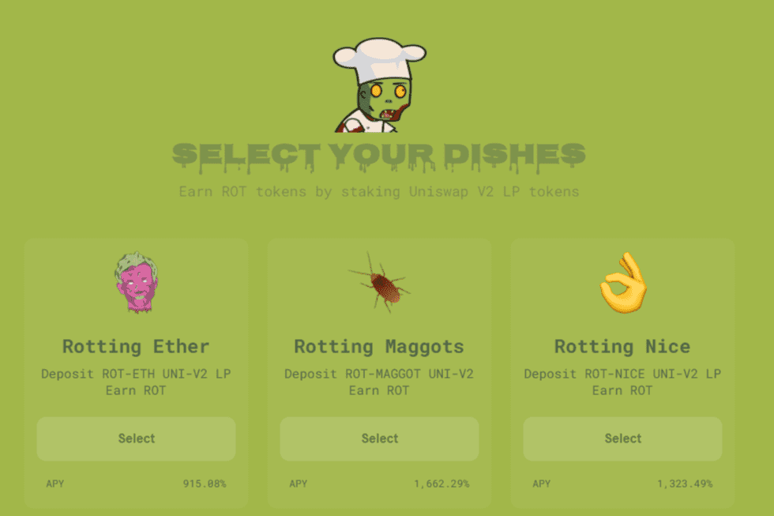

# RottenSwap

Rotten Sushi 代币没有预先挖掘的开发基金，因此无法进行 Chef Nomi 类型的地毯拉动。
  这些矿池旨在通过为 ROT 本身提供流动性来激励农业，而不是为鲸鱼创造一种低风险的方式来抛售较小的持有者以增加其持有量。
  寿司烂了。每次转账，都会有 2.5% 的金额被烧掉并转化为 MAGGOT 代币。 MAGGOT 代币具有高度通货膨胀性，因此毫无价值，但 RottenToken (ROT) 具有通货紧缩性，交易量充足。 ROT 的数量越高，通货紧缩就越多，这可能会形成一个价格/数量增加和供应减少的正反馈循环。这是 SushiSwap 协议的主要实验性变化。

