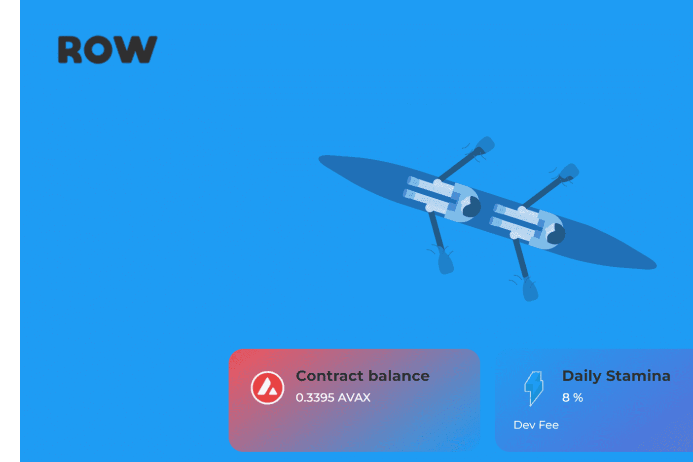

# Rowing Finance Miner

什么是划船金融矿工？
Rowing Finance Miner 是一款非常有趣的 avax 代币矿工。这是一个非常简单但非常强大的智能合约，充当 AVAX 奖励池。
投资回报率：扣除所有采矿费用后，您每天将能够获得初始投资的 8%。
推荐：说服你的朋友开矿并获得他们总投资的 12%。
复合：重新投资您的每日奖励以雇用更多矿工，这些矿工将不停地让划船者离开地面并成倍增加您的收入。
费用：投资和出售赛艇运动员需支付 3% 的开发费用。重新投资奖励时不收取任何费用。
战略：
少数经验丰富的赛艇运动员在没有耗尽他们的地雷的情况下制定了他们最有利可图的策略。
然而，每个人都有自己的地雷，他们作为一个团队一起工作。
他们每周重新雇用（ROW）矿工 6 次，每周获利 1 次（REST）。过于频繁地获利会耗尽您的矿山，从而降低您的短期和长期投资回报。

