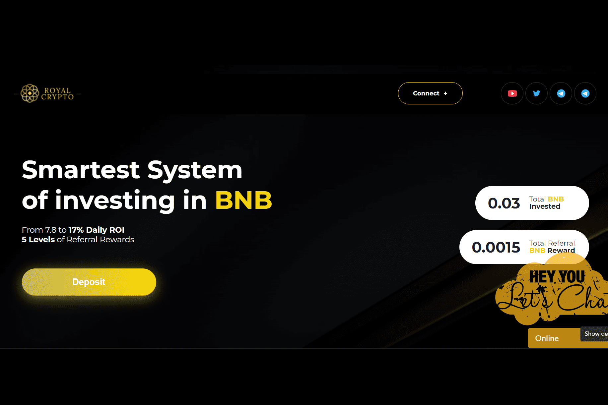

# Royal Crypto

皇家加密货币
- 最智能的 BNB 投资系统。
- 每日投资回报率从 7.8% 到 17%
- 119 - 208% 回报
- 5 级推荐奖励
- 验证 BSC 智能合约

加密货币是一种数字形态的货币。他们属于数字资产，可用于购买商品和服务。加密货币也可储存价值、记账和作为交换中介。分布式账本(又称“区块链”)保障了这种数字资产的安全。第一个加密货币是比特币，中本聪(假名)创造了这种加密货币，并在2009年发布了比特币白皮书。从那以后，这种加密货币已经成为加密货币资产的基准。注意：中国大陆地区禁止加密货币交易、购买和挖矿。

