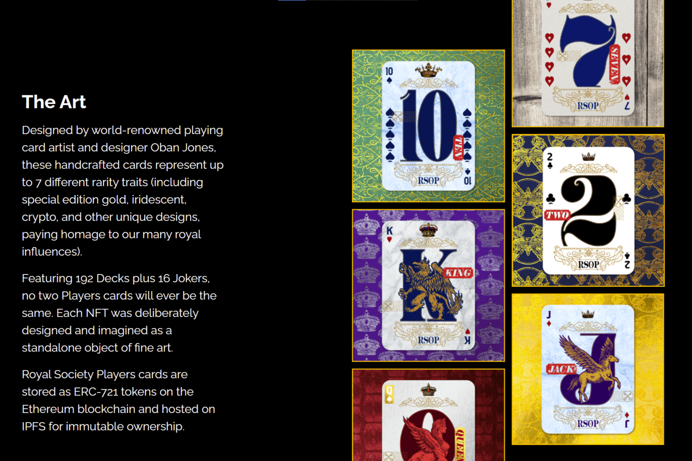

# Royal Society of Players

这些手工制作的卡片由世界著名的扑克牌艺术家和设计师 Oban Jones 设计，代表多达 7 种不同的稀有特性（包括特别版金色、彩虹色、加密和其他独特设计，向我们的众多皇室影响力致敬）。
拥有 192 张套牌和 16 张小丑，没有两张玩家牌会是相同的。每个 NFT 都经过精心设计，并被想象为一个独立的艺术品。
皇家学会球员卡作为 ERC-721 代币存储在以太坊区块链上，并托管在 IPFS 上以实现不可变所有权。

