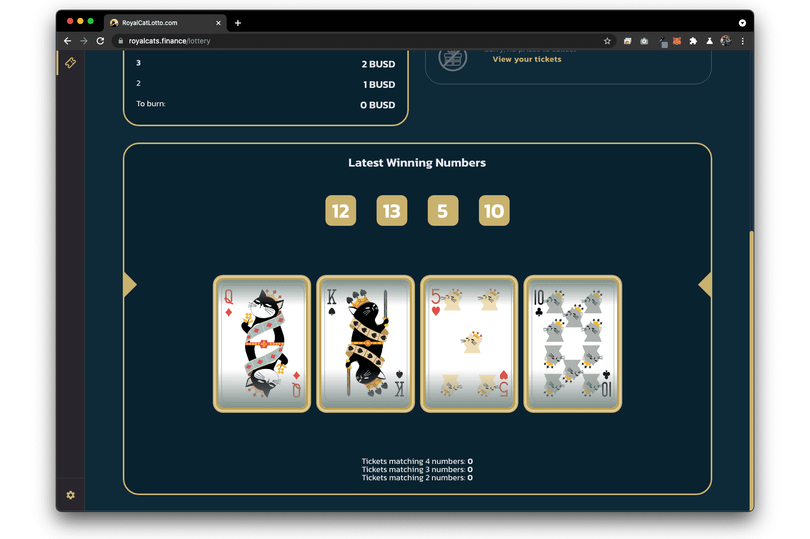

# RoyalCatsLotto

什么是皇家猫乐透？
Royal Cats Lotto 是一个基于区块链的在线彩票平台，使用智能合约进行每次转让和交易，以确保所有客户的安全和责任。

- 累积奖金等级：所有 4 张牌按照位置的确切顺序匹配将赢得 50% 的底池

- 第二梯队：3张牌按照位置的确切顺序匹配将赢得30%的底池

- 第三梯队：2张按位置顺序匹配的牌将赢得10%的底池

允许您以 1:1 与 BUSD 的比例铸造 ROY 代币。我们的交易所没有 ROY/BUSD 交换，这就是为什么我们的交易所添加了这个功能。以下是有关如何通过皇家银行铸造/兑换代币的步骤：

1. 要铸币，首先按“铸币”按钮，然后指定要兑换 BUSD 的 ROY 数量，然后按批准 BUSD。

2. 现在您可以使用您新铸造的 ROY 代币与您最喜欢的稳定币一起耕种，或进行单一代币质押。

3. 要将您的 ROY 兑换回 BUSD 以兑现您的利润，只需按照与铸币 ROY 相同的步骤操作，但请点击“兑换”按钮。

4. 现在您可以使用或兑现您新兑换的 BUSD 代币。

