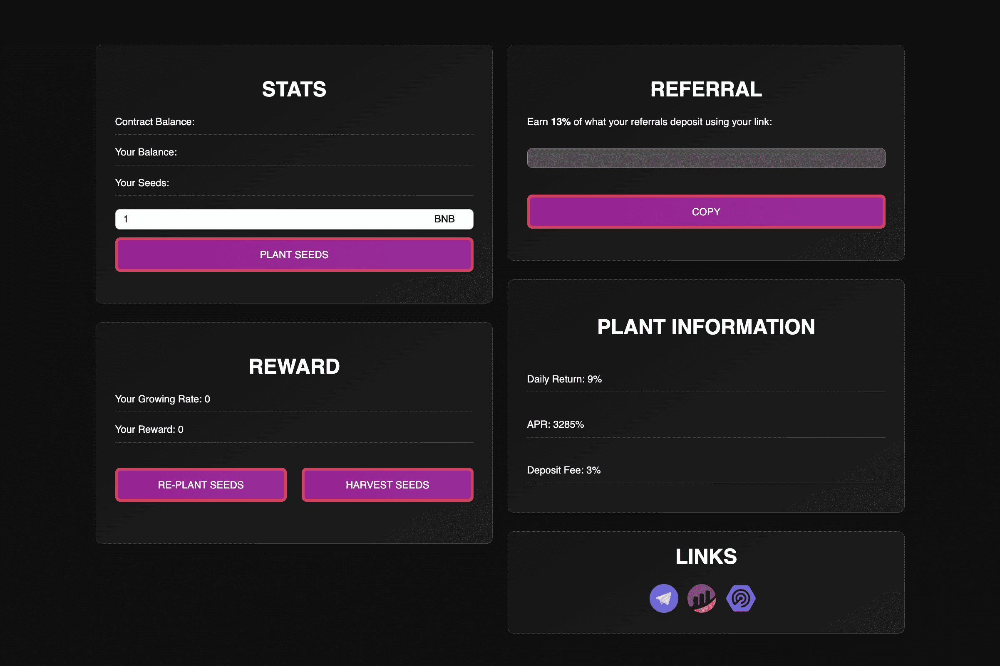

# RoyalFarm.io

皇家农场是一个花哨的代币矿工元。这是一个简单的智能合约，充当 BNB 奖励池，只要奖励池中还有 BNB，每天最多返还您池中 BNB 的 9%*！用户可以选择收获他们的种子（获得他们的 BNB 奖励）或在他们积累时重新种植他们的种子（复合获得的 BNB 奖励）。
种下你的种子，玩得开心，享受你种下的豆子奖励！

什么是皇家农场？
ROYAL FARM 是建立在 BNB 智能链上的去中心化应用程序，为您支付
ROYAL FARM 合约中的 BNB 存款平均每天为 9%。日常
ROI 百分比取决于用户在平台内采取的影响
工厂的增长率。随着用户播种，增长的效率会上升和下降，
重新种植收益并收获 BNB 奖励。

