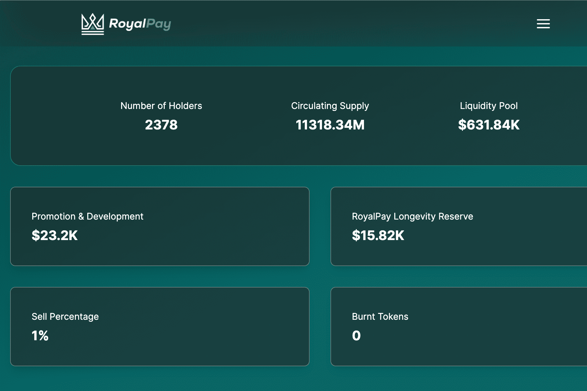

# RoyalPay DApp

RoyalPay 是币安智能链上的一种自动质押和自动复利的去中心化协议，为投资者提供 480,810.4% 的年收益率。
该合约使用反倾销盾牌来保护您的投资和协议的可持续性。防止泵送和倾倒的终极保障。
投资者将能够每天卖出 1-5%，具体取决于当前的卖出限制。
该团队由经验丰富的开发人员、DeFi 社区所有者、成功的高管和其他熟练的同事组成。除此之外，Royalty Finance 与一系列机构合作，以弥合专业知识和关系方面的任何差距。
拥有投资者的信心对于版税的成功也至关重要。
完整的版税财务团队已通过 CertiK 的 KYC 验证。

