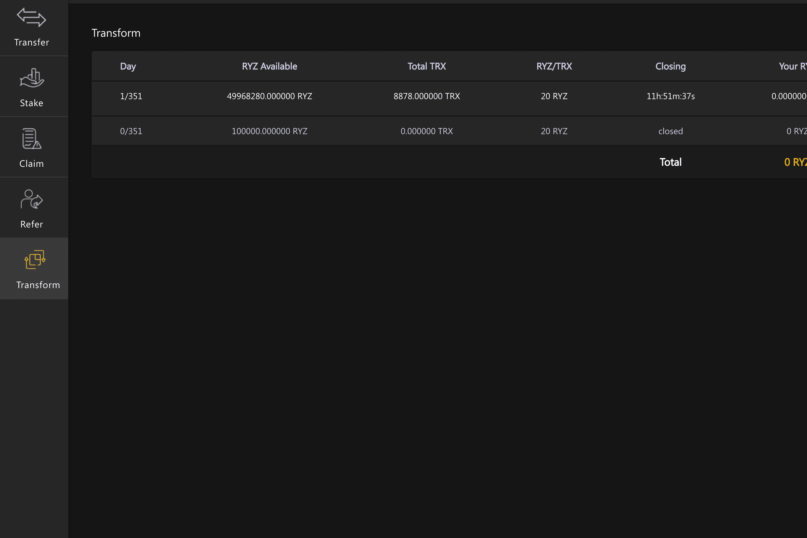

# Royalstarz

RYZ 的质押机制由托管在 Tron 区块链上的智能合约提供支持。该智能合约模仿存款证明，这是一种传统上由银行提供的产品，旨在奖励用户长时间将资金留在账户中。这正是 RYZ 的质押方式，只是它不受任何人控制，并且通过托管在 Tron 上的智能合约完全自动化。但除了这些基于时间的奖励之外，RYZ 还具有内置于协议中的奖励，其中包含 BigPayDay 奖励，可进一步奖励在关键长期质押的用户。这些奖金的规模通常很大，可以显着增加您的持股量。您质押 RYZ 的时间越长，您质押的越多，您获得的奖励就越多。用户可以使用 Adoption Amplifier 工具将 TRX 转换为 RYZ，通过 Claim 工具使用比特币持有量来声明 RYZ，还可以通过引用工具将其他用户推荐给协议来获得奖励。这些工具包括区块链上的存款证明产品。

