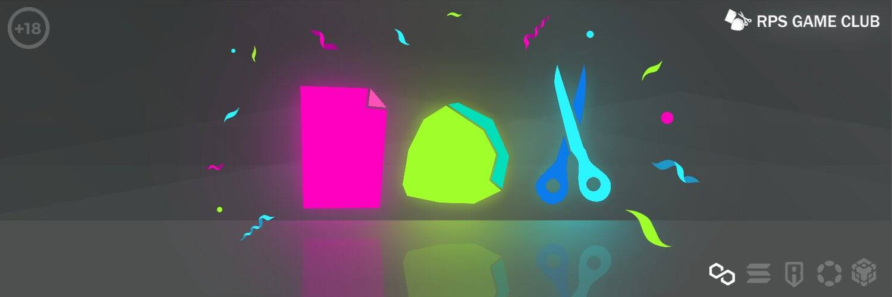

# RPS games Club

我们正在建立一个公平竞争的游戏生态系统，由于我们的公开和经过审计的智能合约，玩家会感到舒适。我们使用由 Chainlink 提供支持的链下服务进行操作，以确保结果的随机性并防止系统被利用和黑客攻击。我们的目标是成为 MultiChain 项目的参考，并为加密生态系统带来价值。
RPS 代表 Rock, Paper, Scissors，这是一种传统游戏，由于 Web3 开发的力量，我们决定将其带回来。它通常在两个对手之间进行；每个玩家同时选择三个可能的结果之一。这些结果是“石头”（闭合的拳头）、“纸”（扁平的手）和“剪刀”（伸出食指和中指的拳头，形成一个 V）。您有 50% 的公正获胜机会，我们不考虑平局。你会选择哪一边？
我们的 NFT 的目标是通过激励质押来奖励我们的持有者，持有者将获得 RPS 游戏总量的 2.5%。您还可以通过我们的 DAO 资源及早获得新的发展和先睹为快。此外，我们的入门价格 (TBA) 很低。你在等什么？

