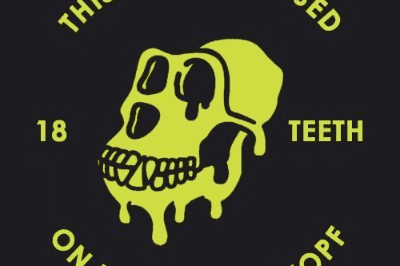

# RRMAYC

自 BAYC 推出以来，我们一直怀疑有什么不对劲。不仅与艺术有关，而且与项目本身背后的创始人有关。我在耶路撒冷生活了 26 年，看到一家公司/品牌/项目对 NFT 市场有如此大的影响，支持种族主义和对犹太人的仇恨是不可接受的。通过发布 RRMAYC 项目，我们希望提醒许多不了解当前情况的人。 BAYC 是一家垄断企业，不应忽视向他们提出的指控。 RRMAYC 将利用社区提供的资金在全国范围内传播种族主义意识。

