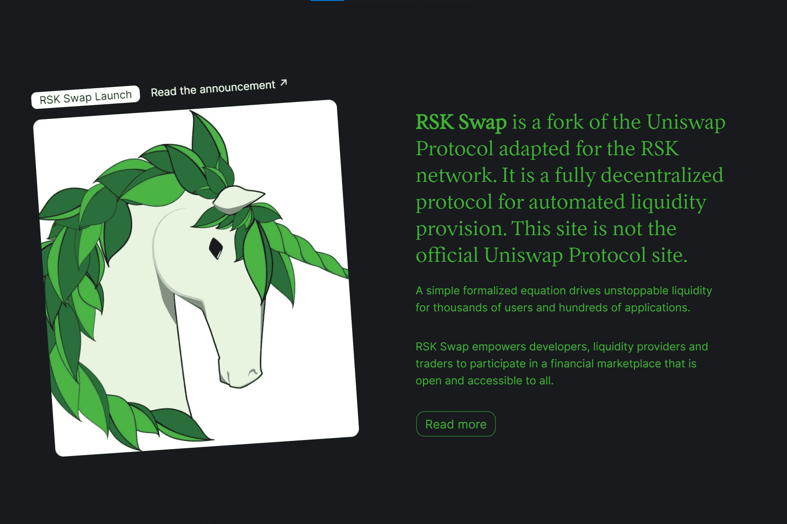

# RSK Swap

RSK 交换是适用于 RSK 网络的 Uniswap 协议的一个分支。它是用于自动提供流动性的完全去中心化协议。该站点不是 Uniswap 协议的官方站点。一个简单的形式化方程为成千上万的用户和数百个应用程序带来了不可阻挡的流动性。 RSK Swap 使开发人员、流动性提供者和交易者能够参与一个对所有人开放和可访问的金融市场。
RSK 交换是 RSK 网络的透明、抗审查的金融基础设施。

Uniswap Protcol 降低了金融参与的门槛并消除了中心故障点。

它使任何人都可以创建新市场、提供流动性并构建以前不可能存在的金融应用程序。

