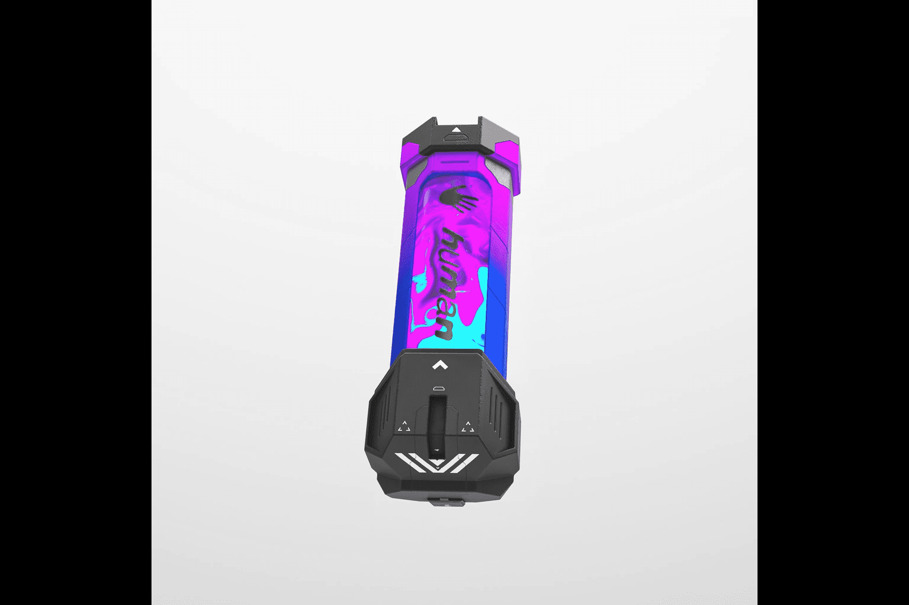

# RTFKT SKIN VIAL: EVO X

RTFKT SKIN VIAL：EVO X NFT 在过去 7 天内售出 117 次。 RTFKT SKIN VIAL: EVO X 的总销售额为 $90.13k。一个 RTFKT SKIN VIAL: EVO X NFT 的平均价格为 770.4 美元。共有 5,662 个 RTFKT SKIN VIAL: EVO X 拥有者，总共拥有 11,821 个代币。

RTFKT 皮肤小瓶可让您更改 RTFKT x NIKE DUNK GENESIS CRYPTOKICKS 或任何兼容 CRYPTOKICKS 与限量版皮肤的外观。

RTFKT 的第一个 Skin Vial Tech 系列 EVO X 具有 8 个基于 Clone X DNA 的进化皮肤

请阅读：由于区块链在购买时处理更改的速度不够快，因此不要购买/投标（on）装备的运动鞋。

为了防止任何漏洞：我们建议
不要尝试购买/投标此系列中带有 Equipped Skins 的运动鞋。

仅购买/投标此系列中的 Skin VIALS：https://opensea.io/collection/skinvial-evox

