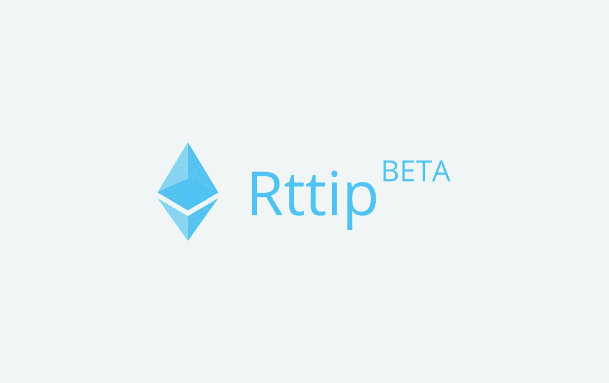

# Rttip

[公测] Rttip 是一个 ETH 打赏 dapps 来影响你的推文。您可以通过创建以 ETH 作为奖励的 RT 扩散请求或转发请求的推文来获得 ETH。需要事先登录 Rttip 才能接收 ETH。如果您有任何问题，请通过 DM 与我们联系。 #rttip #ETH #dapps

 由於已經提到以太坊依賴於比特幣的工作能力和功能及其區塊鏈設計，但是，除了貨幣系統的幫助之外，還有許多應用程序的變化。兩個區塊鏈唯一相同的方面是它們在各自網絡上存儲所有交易歷史，但是，以太坊的區塊鏈往往執行的功能遠不止於此。除了交易歷史之外，以太坊網絡上的每個節點還需要下載網絡中每個合約的最新狀態或俗稱的當前狀態，同時還存儲每個用戶的餘額和智能合約代碼。

