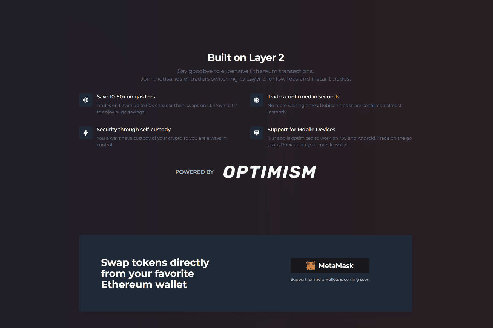

# Rubicon

Rubicon 正在建立世界秩序手册。我们的使命是开放、加速和民主化全球金融市场。 Rubicon v1 是建立在以太坊领先的第 2 层 (L2) 网络上的订单簿协议。您现在可以在 Rubicon 应用程序上交换代币、下限价订单和市价单，并提供流动性。与在以太坊主网上交易相比，在 Rubicon 上的交易只需几美分，而且几乎可以立即确认！ Rubicon 订单簿具有本地流动性池，被动流动性提供者 (LP) 可以在其中存放其加密资产，而主动流动性经理（策略师）在订单簿上部署池流动性。做市商的收益回馈给 LP，而策略师则赚取业绩费。通过 Rubicon Pools，订单簿上的做市收益首次向任何人开放！

