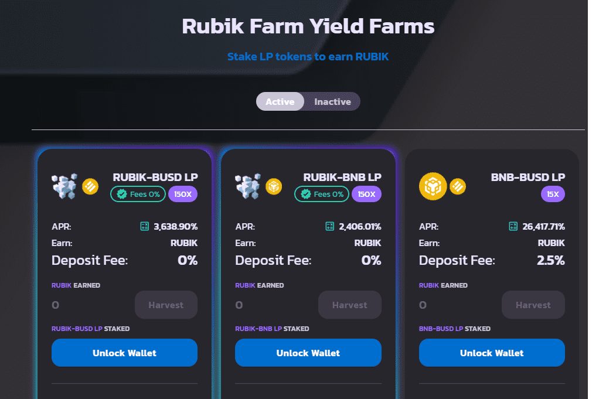

# Rubik Farm

基于币安智能链的最实惠和盈利的 Yieldfarm 具有通货紧缩的代币模型，最大供应量为 400,000 RUBIK 代币。
在审查了几种单产农业模型后，我们决定采用低排放率、低供应、分层农业和面向原生的代币经济学，为我们平台中的原生代币提供最高权重。我们还在这一层中加入了股息池，您可以在其中质押 $RUBIK 以赚取 BUSD，这将激励原生代币持有者。这种模式将帮助最终用户在很长一段时间内获得最大收益。
我们将使用相同的可靠代码来部署 RUBIK 的合约，并且未来将由其他一些审计公司完成审计。
一些突出显示的功能将是：-

  400,000 RUBIK 代币
  面向原生的代币经济学
  启动时的时间锁定
  顶级 BNB 池和农场
  供应不足
  低排放

