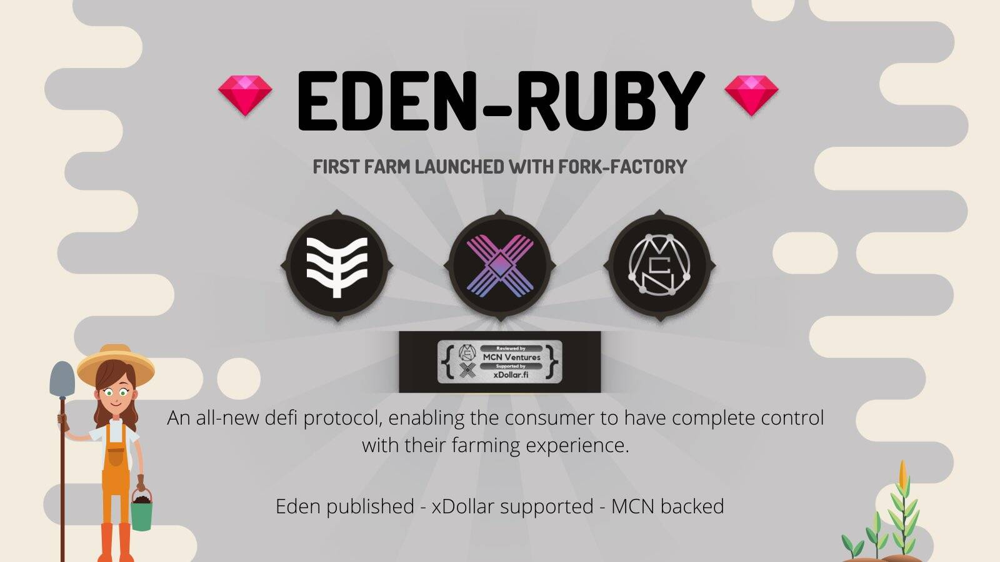

# Ruby

Ruby 是 Eden（以前称为 PolyTopia）的第四层，是宝石种植计划中的第二层，用户将在其中种植宝石，然后可以在稍后阶段交换有限的 NFT 物品，以在其最终平台中使用 - 伊甸园。

区块链 是一个共享的、不可篡改的账本，旨在促进业务网络中的交易记录和资产跟踪流程。 资 *产* 可以是有形的（如房屋、汽车、现金、土地），也可以是无形的（如知识产权、专利、版权、品牌）。 几乎任何有价值的东西都可以在区块链网络上进行跟踪和交易，从而降低各方面的风险和成本。

