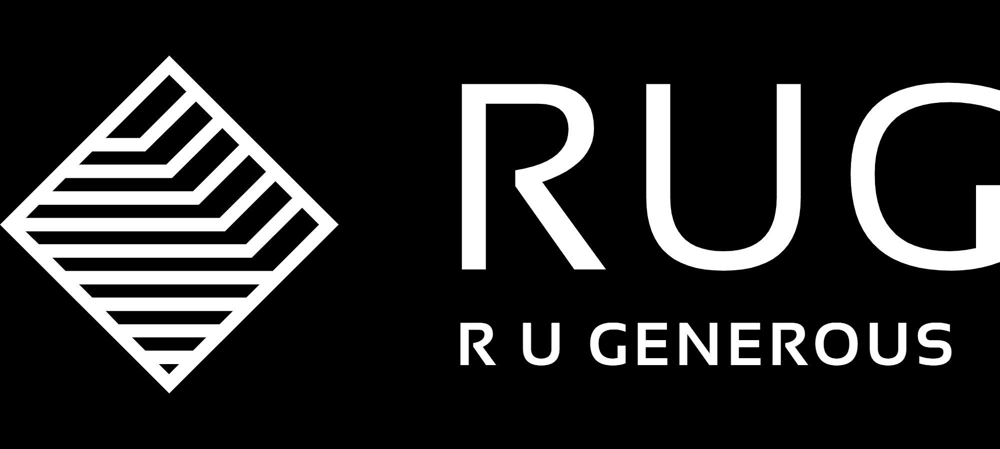

# RUGenerous

RuGenerous 协议
AVAX生态系统上的储备货币和DAO

RU Generous 是 Avalanche 网络上可用的去中心化储备货币协议和 DAO。RUG 目前在金库中由 AVAX 和 MIM 支持，这为 $RUG 代币价值提供了稳定的支持。RUG 与 OHM 类似，通过质押和铸币利用经济和博弈论动态进入市场。

市场参与者有两种主要策略：质押和绑定。 赌注者街

对质押者的主要好处来自供应增长。 该协议从国库中绑定了新的 RUG 代币，其中大部分分配给了质押者。 因此，质押者的收益将来自他们的自动复利余额，尽管价格风险仍然是一个重要的考虑因素。 也就是说，如果代币余额的增加超过了价格的潜在下降（由于通货膨胀），那么质押者将获利。
债券商的主要好处来自价格的一致性。 债券商预先承诺资本，并承诺提供固定的回报

