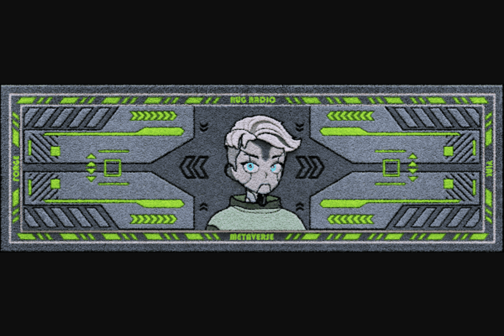

# RugRadio Genesis NFT

RUG RADIO 是第一个完全去中心化的媒体平台。
这是什么意思？ 这意味着我们的会员和我们的房东拥有您使用的平台。 它为什么如此重要？ 因为我们需要拥有叙述和模因。 我们可以一起建立一个网络，在这个网络中，激励措施有利于真相、所有权和对公地的长期关怀。 所有权意味着我们每个人都可以决定我们消费什么，如何交付，我们都从通过它创造的丰富中受益。
Rug Radio 与平台无关，允许我们的主机使用他们想要的任何媒体进行创作。 主机直接从他们的创作中受益，并拥有他们创作的权利。

