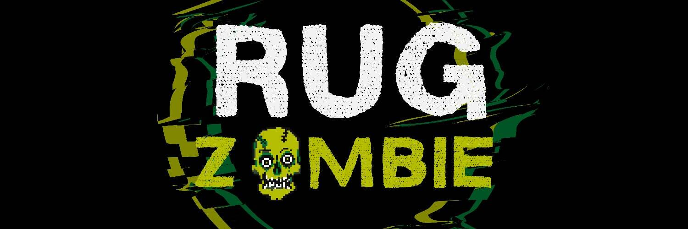

# RugZombie

欢迎来到 RugZombie ($ZMBE)，这是币安智能链上第一个以复活价值为重点的加密货币。
‌
虽然 $ZMBE 无法阻止或预测公众接触“拉扯”或“被骗”的代币，但我们的使命是以宣泄的方式为拉拉项目的受害者提供价值，同时在 Binance 上提供实际效用智能链。
RugZombie 团队从 PancakeSwap 代码的一个分支创建了一个 Dapp，让用户有机会在我们的 GRAVES 或 TOMBS 中质押死代币，以换取定制的 NFT 艺术品作为安慰奖，并通过我们的 $ZMBE 代币获得收益。
‌
我们的“TOMBS”有点不同；用户将需要存入一定数量的死或坚固的代币和一定数量的 RugZombie 的代币来配对一个独特的流动性配对。用户将能够质押他们坚固的代币和 RugZombie 配对，以便在 RugZombie 的原生代币中获得额外收益，就像其他收益农业合约一样。 RugZombie 不是从天上掉下来的，而是从坟墓里爬出来的。

