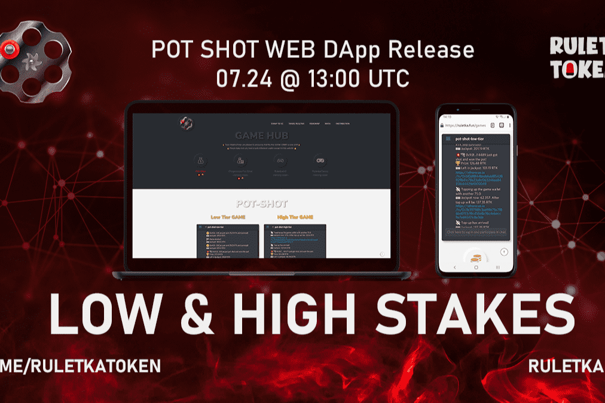

# Ruletka Pot Shot

什么是 Ruletka Pot Shot？

Pot Shot 是第一款基于 Ruletka 代币 1 比 6 机会销毁机制开发的自动化游戏。 这些烧伤被称为“SHOTS
要发送照片，您必须将以太坊钱包连接到我们的网站 DApp - 每次加载页面时都会提示您。
要玩，只需按下您想玩的游戏等级（25 RTK 或 100 RTK）的按钮，然后在您的钱包中确认您的交易。
使用上面的嵌入式聊天日志来追踪您的交易是否成功并赢得了彩池。

